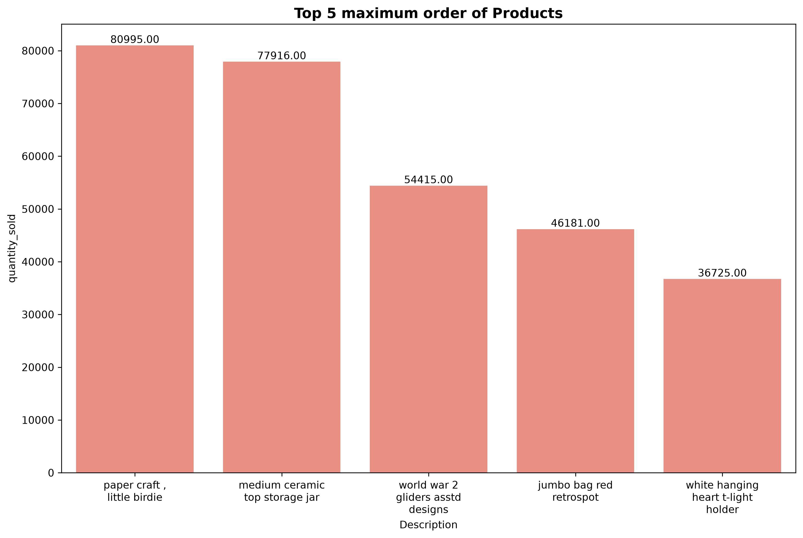
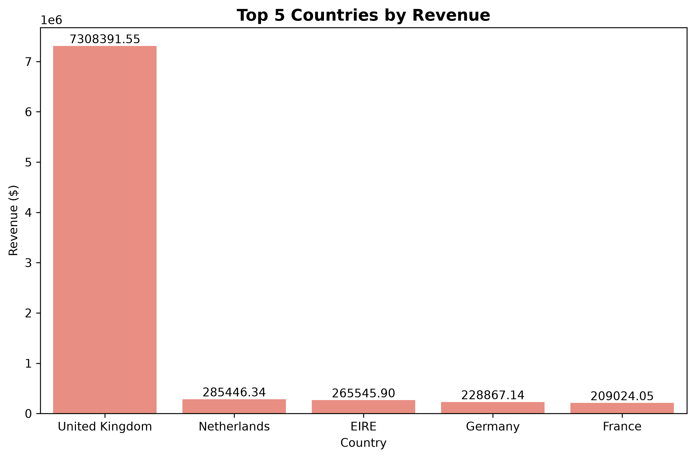

# E-Commerce Sales Analysis

## Project Overview

This project analyzes e-commerce transactions to understand:

- Revenue trends
- Customer behavior
- Product performance
- Country-wise sales
- Business opportunities

## Tools Used

- PostgreSQL
- Python
- Pandas
- Matplotlib
- Seaborn

## Dataset

- Original Rows: 541,909
- Cleaned Rows: 397,884
- Customers: 4,338
- Countries: 37

## Visualizations

### Top Products

### Top Countries

## Key Findings

- Total Revenue ≈ £8.91 Million
- UK generated the highest revenue
- A small number of products generate a large share of sales

## Recommendations

- Increase inventory for top products
- Expand outside the UK market
- Investigate returned products
